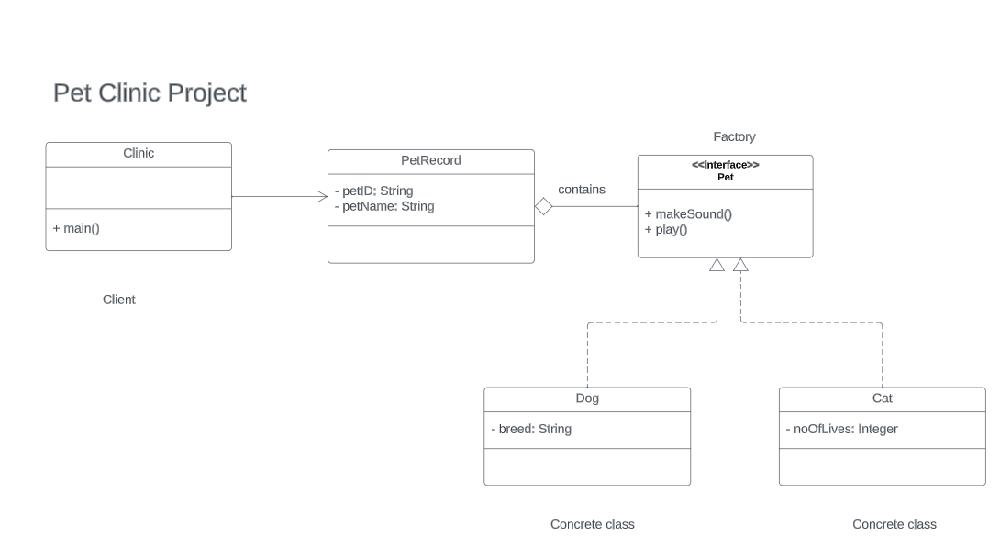

## Problem 
Implement factory design pattern using Pet as the factory interface.  
- The interface implements two methods: makeSound() and play().
- Dog and Cat are concrete objects that implements Pet interface.
- PetRecord holds attributes such as petId, petName, and Pet.
- Clinic would be the client object.

--- 

Below is the **UML Class Diagram** for this activity:

