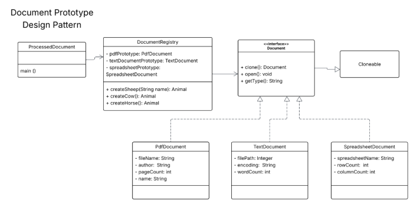

# Document Prototype Design Pattern (Java)

This project demonstrates the **Prototype Design Pattern** using Java.
Instead of creating new objects from scratch, existing objects (prototypes) are cloned to improve efficiency and flexibility.

The system simulates different types of documents:

* PDF Document
* Text Document
* Spreadsheet Document

---

## Design Pattern Used

**Prototype Design Pattern**

### Purpose:

* Create new objects by copying existing ones (cloning)
* Reduce object creation cost
* Improve performance when object creation is expensive

---

## UML Diagram

The implementation is based on the provided UML Diagram, which includes:

* `Document` (Interface)
* `PdfDocument`, `TextDocument`, `SpreadsheetDocument` (Concrete Classes)
* `DocumentRegistry` (Prototype Manager)
* `ProcessedDocument` (Main Class)



---

## How It Works

1. The `DocumentRegistry` initializes prototype objects.
2. Each document type implements the `Document` interface.
3. The `clone()` method creates copies of prototypes.
4. The `main` method demonstrates cloning and usage.

---

## How to Run

1. Open the project in **GitHub Codespaces** or any Java IDE.
2. Make sure all files are inside the `src` folder.
3. Compile and run:

```
javac *.java
java ProcessedDocument
```

---

## Sample Output

```
Creating a PDF Document prototype.
Creating a Text Document prototype.
Creating a Spreadsheet Document prototype.

Opening PDF Document: annual_report_2024.pdf by Acme Corp (150 pages)
Type: PDF, File: annual_report_2024.pdf, Author: Acme Corp, Pages: 150

Opening Text Document: meeting_notes.txt with encoding: UTF-8 (250 words)
Type: Text, Path: meeting_notes.txt, Encoding: UTF-8, Words: 250

Opening Spreadsheet Document: sales_data_q1.xlsx (1000 rows, 20 columns)
Type: Spreadsheet, Name: sales_data_q1.xlsx, Rows: 1000, Columns: 20

Opening PDF Document: summary_report.pdf by Acme Corp (30 pages)
```