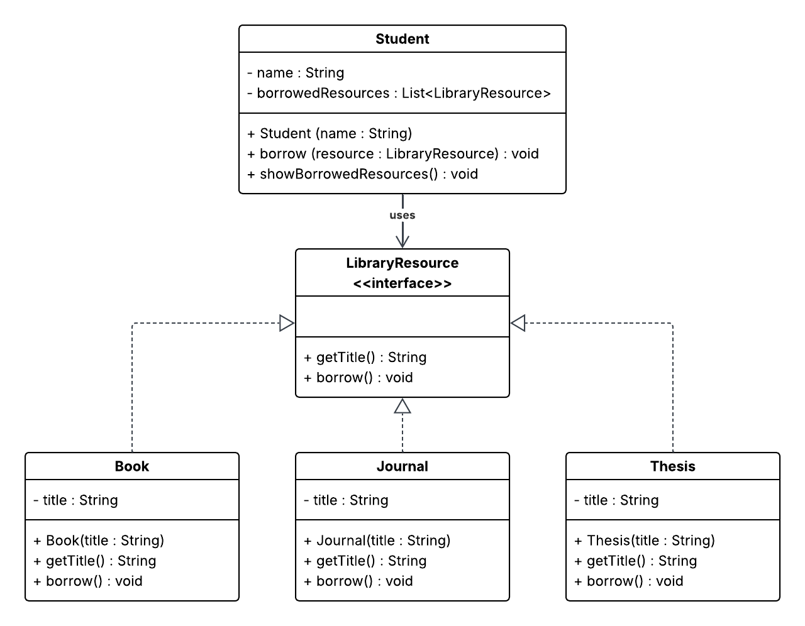

# NEU Library System - SOLID Principles

## Problem Statement

The NEU Library system currently allows students to borrow resources such as books and journals using specific methods like:

- `borrowBook(String title)`
- `borrowJournal(String title)`

This design creates **tight coupling** between the `Student` class and specific resource types, violating the **Dependency Inversion Principle (DIP)**.

As a result, the system becomes difficult to extend when introducing new resource types such as:
- Audio Books
- E-Journals
- Theses
- Capstones

---

## Objective

Refactor the system to:
- Follow **SOLID Principles**
- Apply **Dependency Inversion Principle (DIP)**
- Improve flexibility and scalability
- Allow easy addition of new resource types without modifying existing code

---

## Applied SOLID Principles

### Single Responsibility Principle (SRP)
Each class has a single responsibility:
- `Student` → manages borrowing
- Resource classes → define resource behavior

### Open/Closed Principle (OCP)
The system is open for extension but closed for modification:
- New resource types can be added without changing existing code

### Liskov Substitution Principle (LSP)
All resource types (`Book`, `Journal`, `Thesis`) can be used wherever `LibraryResource` is expected.

### Interface Segregation Principle (ISP)
A small and focused interface (`LibraryResource`) is used.

### Dependency Inversion Principle (DIP)
- High-level module (`Student`) depends on abstraction (`LibraryResource`)
- Not on concrete classes like `Book` or `Journal`

---

Below is the **UML Class Diagram** for this project:

