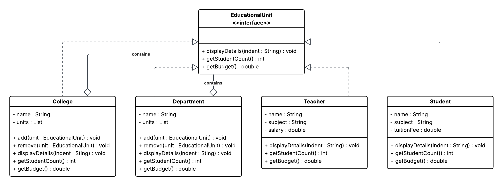

# New Era University System - Composite Design Pattern

## Files
- `EducationalUnit.java` - Interface (Component)
- `College.java` - Composite (college structure)
- `Department.java` - Composite (department structure)
- `Teacher.java` - Leaf (teacher entity)
- `Student.java` - Leaf (student entity)
- `Main.java` - Main application

---
## How to Run

```bash
javac *.java
java Main
```

---
## Expected Output

```
===== STRUCTURE =====
College: College of Engineering
   Department: Computer Science
      Teacher: Mr. Santos | Subject: Programming | Salary: 50000
      Student: Juan | ID: 2023001 | Tuition: 20000
      Student: Maria | ID: 2023002 | Tuition: 20000
   Department: Information Technology
      Teacher: Ms. Cruz | Subject: Networking | Salary: 45000
      Student: Pedro | ID: 2023003 | Tuition: 18000

Total Students: 3
Total Budget: 37000.0
```

---
## How It Works
- `EducationalUnit` defines common methods for all units
- `College` and `Department` store a list of `EducationalUnit` (composite nodes)
- `Teacher` returns salary as budget (positive value)
- `Student` returns tuition fee as negative budget
-  `getStudentCount()` recursively counts all students
- `getBudget()` recursively computes total budget
- `displayDetails()` prints the hierarchical structure

--- 
Below is the **UML Class Diagram** for this project:
